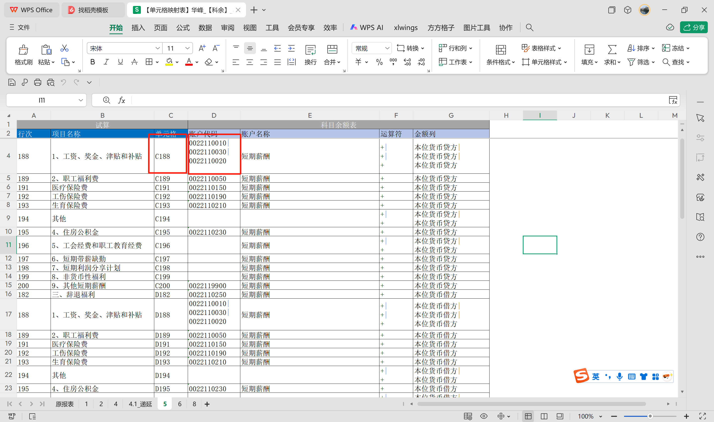
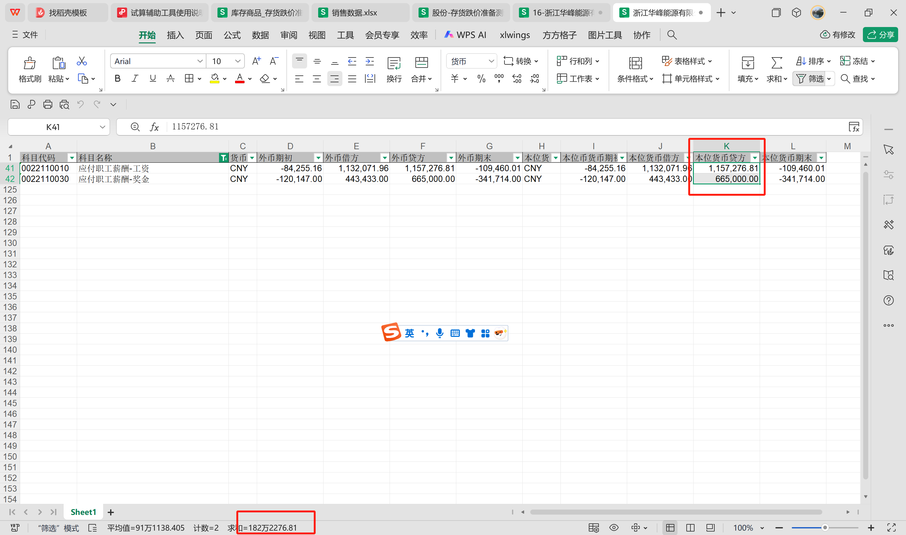
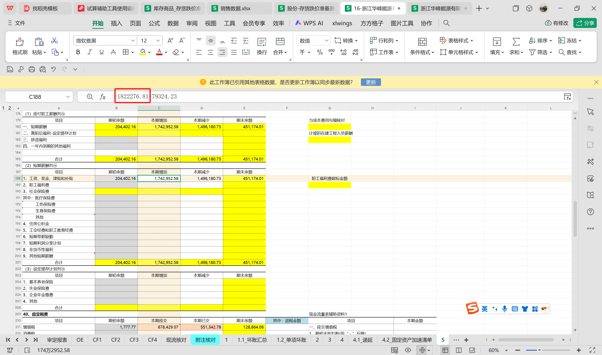
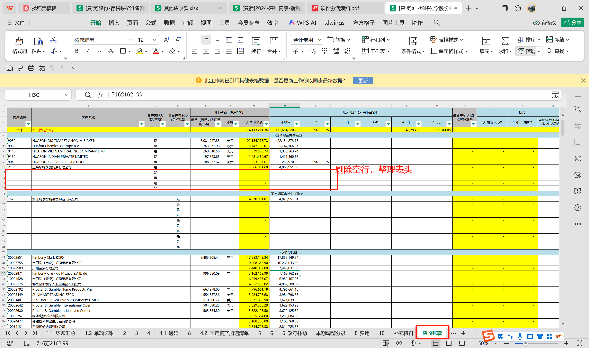
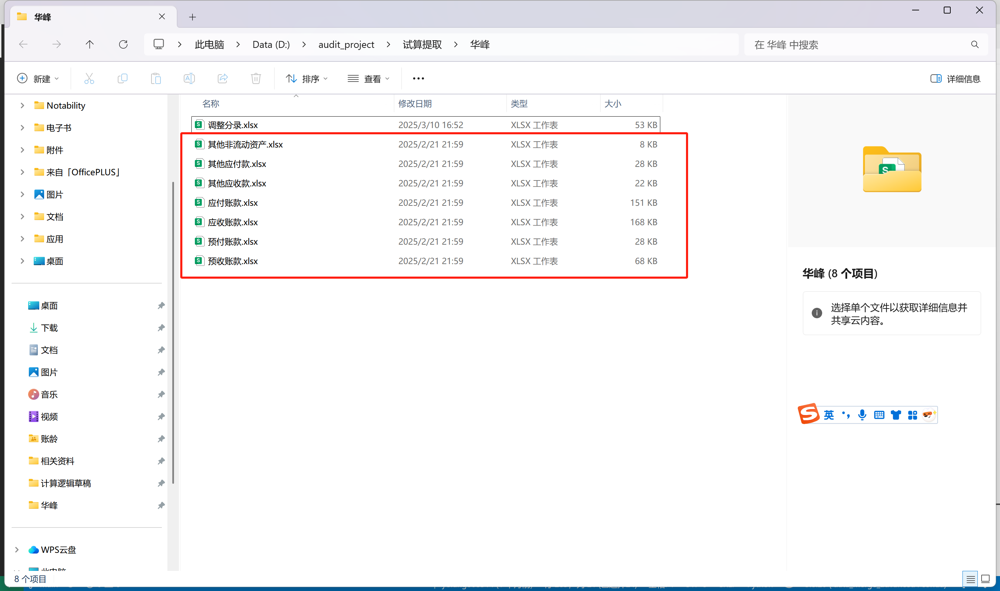
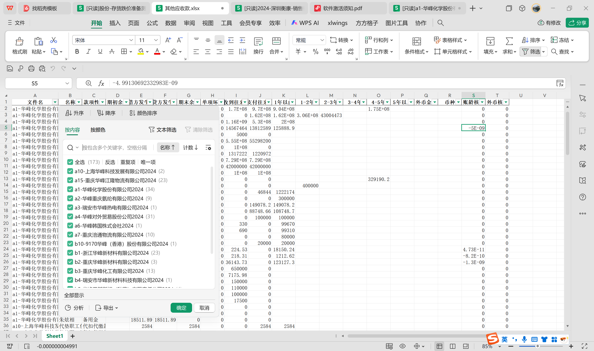

# 交接文档
此文档仅解释程序功能使用，程序具体操作指南详见/文档文件夹

## 1.开发环境

### 1.1开发工具库：
本工具为在本地运行，使用python3.8开发
使用pandas duckdb 等库进行对数据的处理清洗
使用 xlwings openpyxl 进行数据对excel文件的交互
通过streamlit 作为视觉交互的工具

## 2.功能描述
### 2.1功能一、将数据写入excel试算文件

**因填写试算底稿的过程中存在大量机械化的手工复制粘贴的操作故开发了此功能： 通过定义映射表可以批量将数据从【科目余额表】复制到【试算底稿】，节省了部分时间。**

以下图【映射表】为例，【试算底稿】单元格C188的金额是【科目余额表】0022开头的三个科目[本位货币贷方]列的总和，  
此映射表定义了【试算底稿】和【科目余额表】的对应关系。

下图为【科目余额表】相关科目的金额1822276.81

下图为【试算底稿】C188单元格的金额1822276.81（在一般情况下不会有后面79324.23的调整数，可能是由一正一付的特殊情况引起的，试算底稿会在别的地方有校验来提示审计人员手工调整）

### 2.2功能二、从excel试算文件提取数据

**因审计需要对合并报表的做复核，需要从试算底稿中提取往来数据（应收账款、应付账款、预收账款、预付账款、其他应收款、其他应付款等） ，因数据手工提取工作量较大且格式不统一，故主要开发了main_merge_raw_wb()功能**

该功能主要使用pandas openpyxl对excel底稿数据进行读取、清洗、合并最终将不同公司的往来数据集中到一个表格中。
1.让用户选择试算底稿所在的路径

2.以sheet[应收账款]为例，清洗空行，整理表头，遍历整个文件夹的试算底稿，将所有公司的sheet[应收账款]合并到同一个文件

3.1下图为输出的结果

3.2以应收账款为例，各公司的应收账款情况在同一个表中
