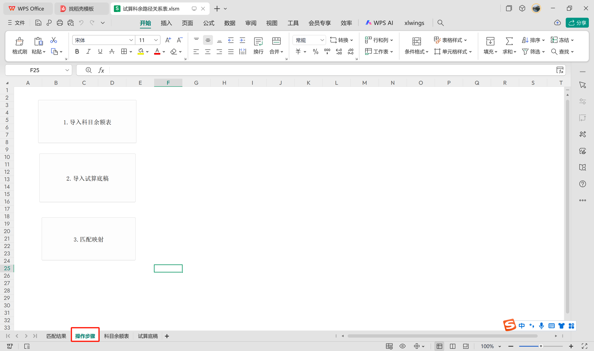

# 试算填写辅助工具使用说明

## 一、使用前准备工作

### 1.wps宏安全设置
1.打开WPS找到工具栏的：工具-开发工具

2.点击宏安全性

3.全部勾选后确定

### 2.新纪元导出科目余额表说明

1.转到账户汇总窗口，  
勾选[默认年度空账户、默认含期间空账户、默认含期末平账户]

2.展开科目设置见下图

3.勾选"余额正负调整"

4.导出选择

5.推荐勾选设置（可随意选择）

### 3.试算科余路径关系表操作说明
1.此表是用来记录【科目余额表】和【试算底稿】的路径对应关系的，采用文件名的前四位作为索引号。 
！！！！请在导出科目余额表时尽量和试算底稿文件名称一致 ！！！！ 

2.此xlsm文件在sheet<操作步骤>中有三个按钮，在导入科目余额表后，依此点击此三按钮即可得到sheet<匹配结果>

3.sheet<匹配结果>示例如下

## 二、正式使用

### 1.模式一、单文件模式
1.选择"单文件执行"

2.上传【试算单元格映射表】

3.输入【科目余额表】、【试算底稿】文件路径 xlsx格式

4.点击【执行】按钮，等待执行完成，查看结果

5.！！！！执行日志会记录哪些“一级科目”在【科目余额表】没有被刷到【试算底稿】，哪些有差异！！！！

### 2.模式二、批量循环模式
1.选择批量循环执行

2.上传【试算单元格映射表】(已上传了不用重复上传了)

3.上传【试算科余路径关系表】

4.点击【执行】按钮，等待执行完成，查看结果  
！！！！执行过程中不要打开【试算底稿】会报错！！！！！

